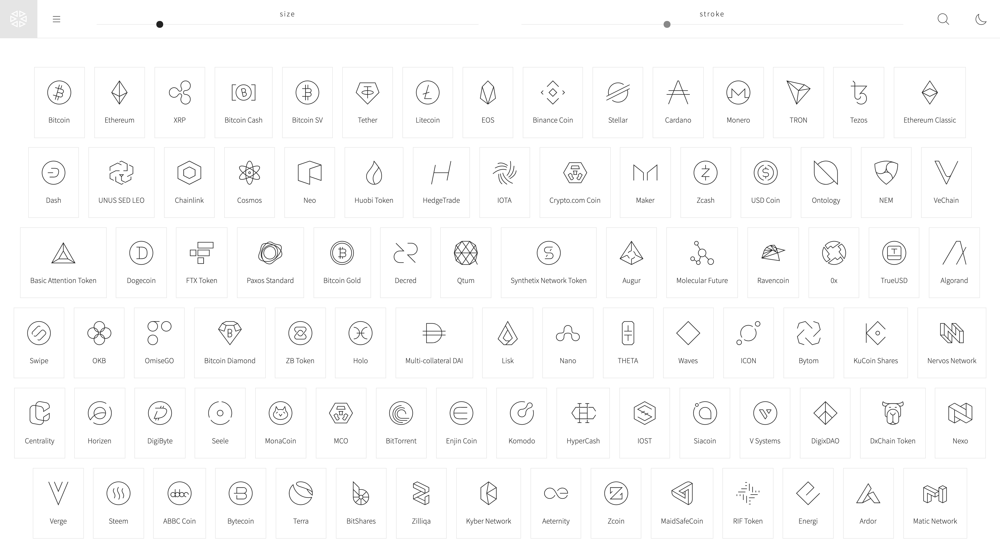

Fusion 
======

Fusion is an open source Line-Icon-Set what include the Top Tokens/Chains Symbols handcrafted and made with lines only. (no fills). This pack grow over time.




Adjust / Tweak
----

You can finetune the css attributes: stroke-width and stroke to finetune the icons to your needs. You can see a demo [here](https://fusion.li).


Using the Fusion Icon Set
----

There are a lot of way's to implement SVG Icons inline into your Website, App, dApp. You can use PHP to include svg's, replace placeholders with client side with jscript, or use a spritesheet. However you wana add these Icons - it's up to you. Here is on of many solutions that works quite easy out of the box.

SVG Sprites
----

1. Download [`fusion-coins.svg`](sprites/fusion-coins.svg) and [`fusion-interface.svg`](sprites/fusion-interface.svg) to your project.

2. Define CSS

```css
.fusion{
background-color: white;
stroke: black;
stroke-width: 2px;
width:64px;
height:64px;
fill: none;
}
```

3. Add HTML Markup

Use the spritesheet what contains the icon you need, and add the icons name behind the #

```html
<svg class="fusion">
<use xlink:href="sprites/fusion-interface.svg#alarm"></use>
</svg>

<svg class="fusion">
<use xlink:href="sprites/fusion-interface.svg#coffee"></use>
</svg>

<svg class="fusion">
<use xlink:href="sprites/fusion-coins.svg#BTC_1"></use>
</svg>

<svg class="fusion">
<use xlink:href="sprites/fusion-coins.svg#ETH_1027"></use>
</svg>

}
```


Roadmap / Things to expect
----

- starting with the top 500 coin icons
- social media icons
- interface icons
- other relevant usefull crypto related icons 


You can help!
----

Please consider support this open source project on Gitcoin Grands / a direct donation [here](https://fusion.li/donate).


File naming convention
----

I go with the Coinmarketcap format's : [symbol] + _ + [cmcId] + .svg
Example : ETH_1027.svg or XRP_52


Demo
----

You can see a demo [here](https://fusion.li).


License
----
See [LICENSE](LICENSE)